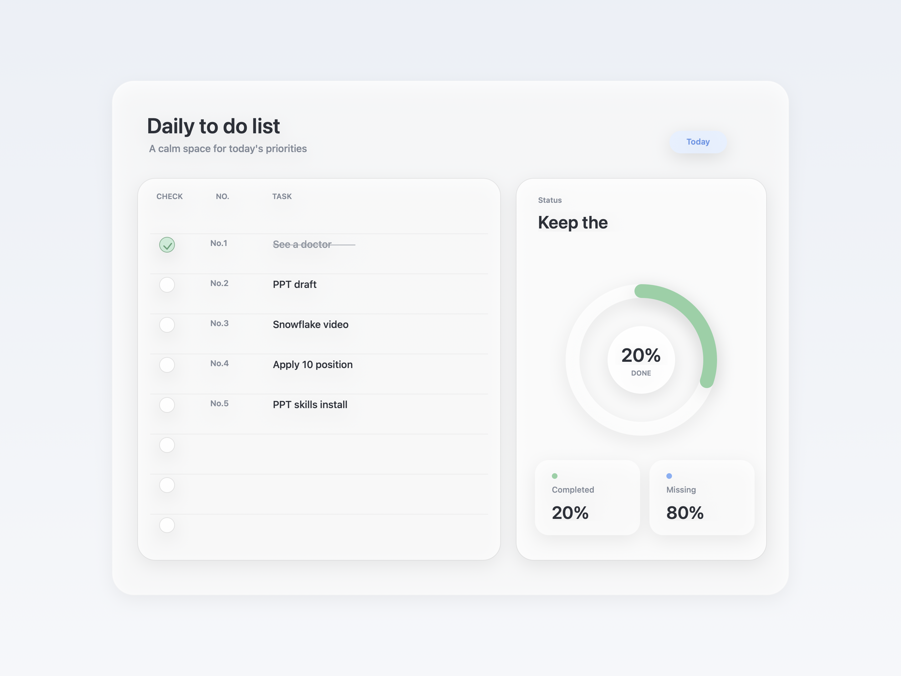
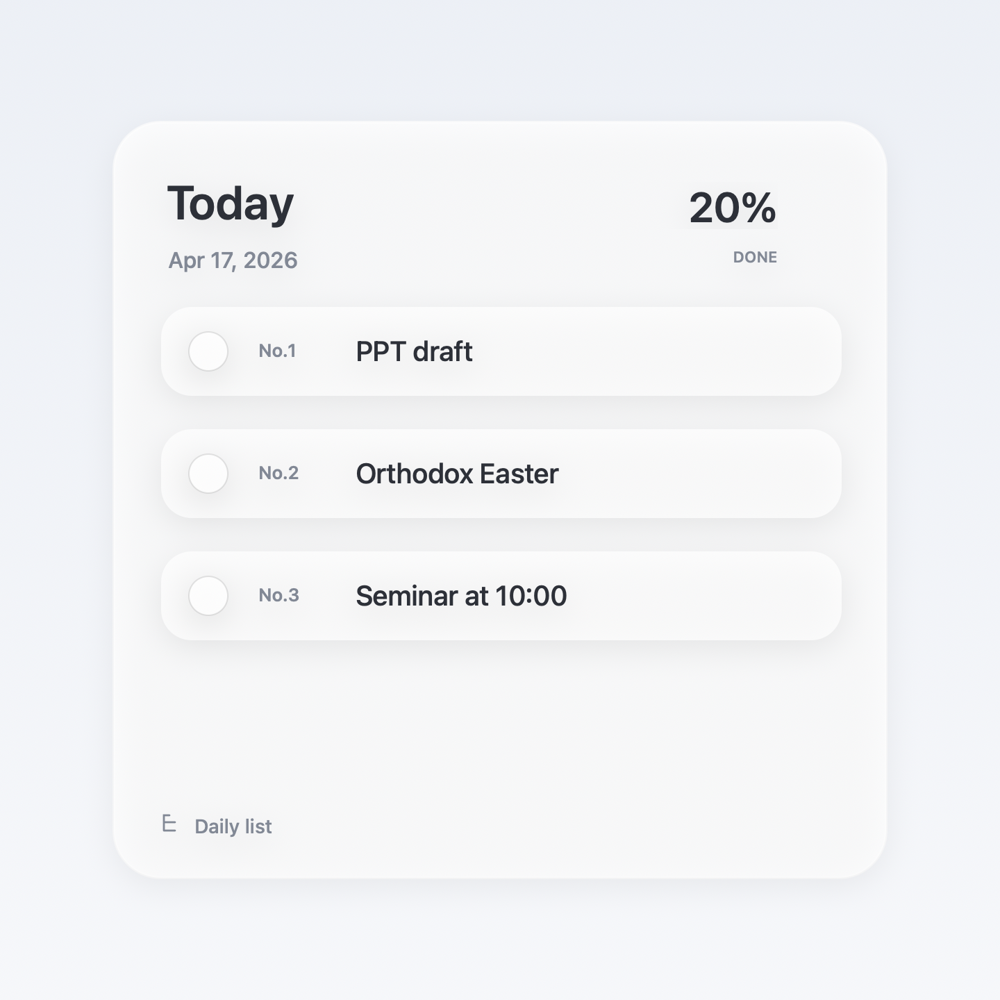

# Floating Todo Widget

An Apple-inspired floating desktop daily todo app for macOS, built with SwiftUI.




## Features

- Floating always-on-top desktop widget window
- Freely resizable window
- Automatic mini mode when the window is small
- Apple-style polished UI with soft glass panels
- Editable daily task list with per-day saved content
- Yesterday / Today / Tomorrow date navigation
- Strike-through styling for completed tasks
- Numbering only for rows that contain task text
- Live completion ring and summary stats
- Press `Enter` to move to the next task row
- Auto-save with `UserDefaults` so each day persists between launches
- Double-clickable `.app` packaging support

## Project Structure

- `Sources/FloatingTodoWidget/main.swift`: the SwiftUI desktop widget app
- `Package.swift`: Swift Package Manager configuration
- `package_app.sh`: packages the release build as `FloatingTodoWidget.app`
- `Info.plist`: app bundle metadata
- `make_icon.swift`: generates the assignment-style macOS app icon
- `daily-todo-widget.html`: original standalone HTML version

## How It Works

- Each date has its own saved todo list
- Use the top-left date controls to move between days
- When the window is resized smaller, the app switches into a compact mini preview of today's tasks
- The app does not sync with Calendar; it is a standalone daily task app

## Run Locally

```bash
swift run
```

## Build Release

```bash
env CLANG_MODULE_CACHE_PATH=.build/module-cache swift build -c release
```

## Package as a macOS App

```bash
zsh package_app.sh
```

This creates:

```bash
FloatingTodoWidget.app
```

## Install

Copy the generated app into `Applications`:

```bash
cp -R FloatingTodoWidget.app /Applications/FloatingTodoWidget.app
```

## Notes

- The widget is designed for macOS 13+
- Build artifacts and local packaged apps are ignored by git
- The app does not auto-launch at login
